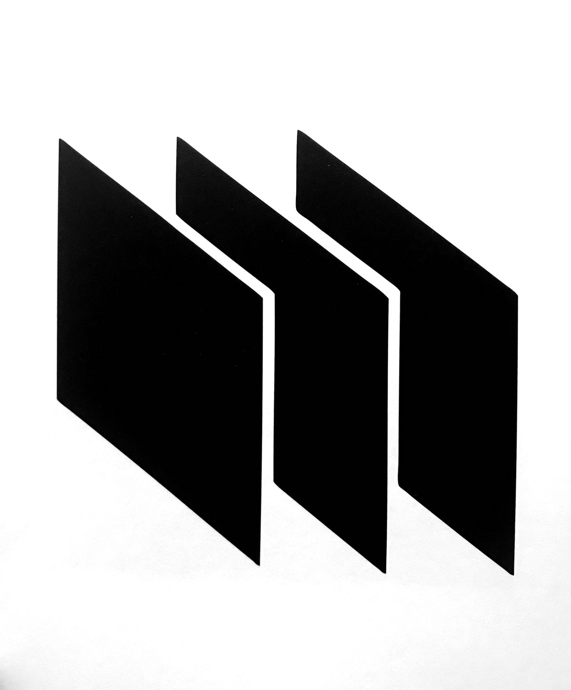

<p align="center">
  
</p>

<h1 align="center">Meridian</h1>

<p align="center">
  A fully customizable, all-in-one frontend for organizing and playing your ROM collection.<br>
  Your personal game library for all things emulators.
</p>

<p align="center">
  <a href="LICENSE">AGPL-3.0</a> · <a href="CHANGELOG.md">Changelog</a> · <a href="CONTRIBUTING.md">Contributing</a>
</p>

---

> **Meridian does not include, distribute, or provide any means to download ROMs, BIOS files, or copyrighted game content.** Users are solely responsible for obtaining ROM files legally and in compliance with their local laws. Distributing copyrighted ROMs is illegal. The developers assume no liability for how users obtain or use ROM files.

## Features

- **Unified ROM Library** — Scan and index ROMs across directories and platforms.
- **Emulator Integration** — Launch any emulator directly with per-system defaults.
- **Metadata Scraping** — Fetch box art, screenshots, descriptions, and more.
- **Collections & Favorites** — Custom lists, play tracking, favourites.
- **Customizable UI** — Themes, layouts, display options.
- **Controller & Keyboard** — Full navigation without a mouse.
- **Lightweight & Native** — Python + Qt. No browser, no Electron.

## Quick Start

**Requirements:** Windows 10/11 (64-bit), Python 3.10+, legally obtained ROMs.

```bash
git clone https://github.com/UglyDuckling251/Meridian.git
cd Meridian
pip install -r requirements.txt
python main.py
```

Or double-click `run.bat`.

## Status

Early development. Core window, menu system, settings dialog, and config persistence are in place. Game browser, emulator launching, and metadata scraping are next.

## Contributing

See [CONTRIBUTING.md](CONTRIBUTING.md). All PRs target the `dev` branch. Do not submit contributions that reference pirated content — they will be rejected.

## License

[AGPL-3.0](LICENSE). Modified versions must be released under the same license.

## Acknowledgments

Inspired by [ES-DE](https://es-de.org/), [Playnite](https://playnite.link/), [LaunchBox](https://www.launchbox-app.com/), and [Pegasus](https://pegasus-frontend.org/).
